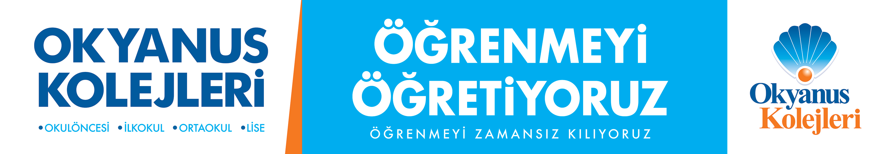

# 🌊 Okyanus Koleji - İnteraktif Eğitim Platformu

<div align="center">
  
  
  ### Okyanus Koleji Okulları İçin İnteraktif Eğitim Materyalleri
  
  [](https://www.okyanuskoleji.k12.tr/)
  [](https://www.typescriptlang.org/)
  [](https://vitejs.dev/)
  
</div>

---

## 📖 Hakkında

Bu proje, **Okyanus Koleji** öğrencileri için özel olarak geliştirilmiş bir dijital eğitim platformudur. Platformun temel amacı, ders anlatımlarını statik videolardan çıkarıp, öğrencinin aktif olarak katılabileceği HTML5 tabanlı **interaktif eğitim materyalleri** ile zenginleştirmektir.

Platform üzerinden öğrenciler, sınıf ve tema bazında ayrıştırılmış konulara ulaşabilir ve her konu için özel olarak hazırlanmış interaktif "Yapalım Öğrenelim" etkinliklerini, oyunları ve testleri uygulayabilirler.

---

## 🎯 Proje Amacı

- **Etkileşimli Öğrenme:** Öğrencilerin sadece izleyerek değil, tıklayarak, sürükleyerek ve çözerek öğrenmesini sağlamak.
- **Dijital Dönüşüm:** Klasik ders kitaplarını ve sunumları, web tabanlı modern eğitim araçlarına dönüştürmek.
- **Kolay Erişim:** Herhangi bir üyelik veya uygulama yüklemesi gerektirmeden, web tarayıcısı üzerinden tüm materyallere anında erişim.

---

## ✨ Özellikler

- **📂 Yapılandırılmış Müfredat:** 1., 2., 3. ve 4. sınıf seviyelerine göre ayrılmış, tema ve konu bazlı organize edilmiş içerik yapısı.
- **🚀 İnteraktif Konu Anlatımları:** Her konu için özel butonlarla başlatılan, tam ekran çalışan zengin HTML içerikleri.
- **⚡ Yüksek Performans:** Tamamen statik site mimarisi sayesinde bekleme süresi olmadan hızlı açılan sayfalar.
- **📱 Tüm Cihazlara Uyumlu:** Akıllı tahta, tablet, bilgisayar ve telefonlarda sorunsuz çalışır.

---

## 🛠️ Teknik Altyapı

Proje, modern web teknolojileri kullanılarak performans ve sürdürülebilirlik odaklı geliştirilmiştir:

- **Frontend:** Vite, TypeScript, Vanilla CSS
- **Mimari:** Statik Site (Serverless)
- **Veri Yönetimi:** Konfigürasyon tabanlı (Config-Based) veri yapısı (`src/data/curriculum.ts`), veritabanı gereksinimini ortadan kaldırır.

---

## 📚 İçerik ve Müfredat Yönetimi

Bu platformda yeni bir konu veya interaktif materyal eklemek yazılım bilgisi gerektirmez, sadece bir dosya düzenlemesi yeterlidir.

### Yeni Bir İnteraktif Ders Nasıl Eklenir?

1. **Materyali Hazırlayın:** Hazırladığınız HTML/JS/CSS tabanlı interaktif ders klasörünü (Örn: `Geometrik-Cisimler`) projenin `public/ders-materyal/` klasörü içine atın.
2. **Sisteme Tanımlayın:** `src/data/curriculum.ts` dosyasını açın ve ilgili sınıf/tema altına şu satırı ekleyin:

```typescript
{
  id: 't1-k1', 
  title: 'Konu Başlığı', 
  youtubeId: '', 
  materialUrl: '/ders-materyal/KlasorAdi/index.html', // Klasör yolunu buraya yazın
  order: 1
}
```

3. **Yayınlayın:** Değişiklikler anında sitede görünür ve "İnteraktif Konu Anlatımını Başlat" butonu aktif hale gelir.

---

## 🚀 Kurulum ve Çalıştırma

Projeyi yerel bilgisayarınızda çalıştırmak için:

1. **Repoyu indirin:**
   ```bash
   git clone https://github.com/BemreSTR/okyanuskoleji.git
   cd okyanuskoleji
   ```

2. **Gerekli paketleri yükleyin:**
   ```bash
   npm install
   ```

3. **Projeyi başlatın:**
   ```bash
   npm run dev
   ```

4. **Tarayıcıda görüntüleyin:** `http://localhost:5173` adresine gidin.
